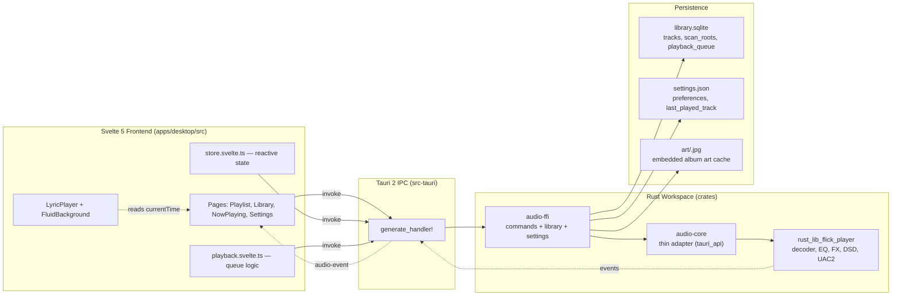
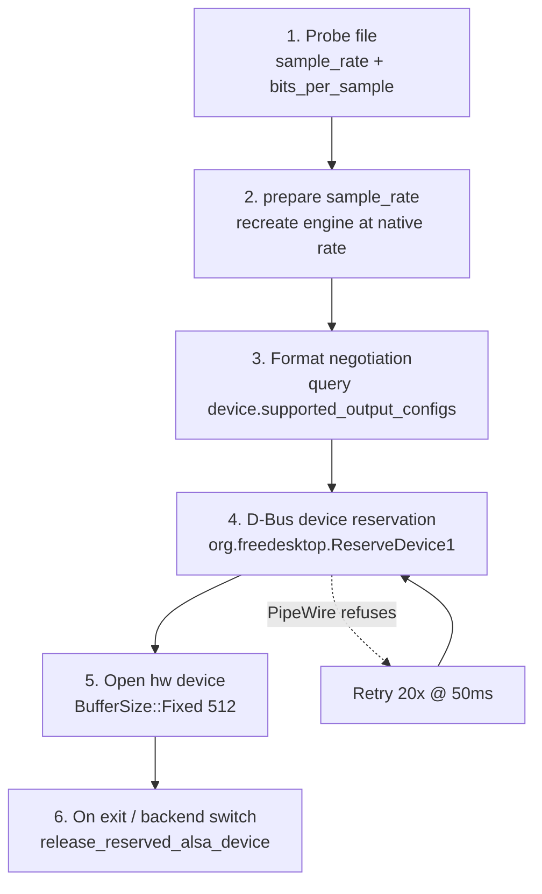
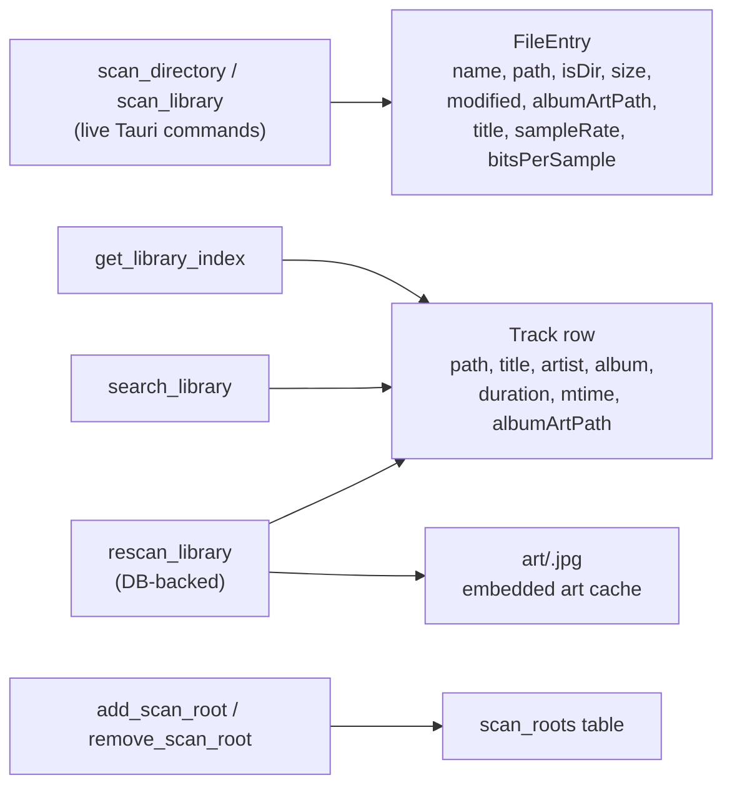

# utoaudio

> *Charming but lightweight* — an open-source, cross-platform, audiophile-grade
> music player with bit-perfect audio output and a beautiful liquid-glass UI.

[](LICENSE)
[](#build)
[](#build)
[](https://tauri.app)
[](https://svelte.dev)

`utoaudio` is a Tauri 2 application: a Rust core driving a bit-perfect audio
engine, wrapped by a Svelte 5 (runes) + TypeScript + Vite frontend. It targets
**Linux desktop** (primary) and **Android** (secondary).

---

## Visual identity

utoaudio speaks the language of **liquid glass** — a pure white base,
highly transparent surfaces, `backdrop-filter` blur, soft rounded edges,
and subtle depth shadows. The aesthetic is achieved entirely with native
CSS — no shaders, canvas, WebGL, or glassmorphism libraries.

### Palette

| Token | Value | Role |
|---|---|---|
| `--uto-bg` | `#ffffff` | Pure white base (not shiny, not tinted) |
| `--uto-surface` | `rgba(255,255,255,0.25)` | Highly transparent glass surfaces |
| `--uto-glass-blur` | `20px` | `backdrop-filter` blur radius |
| `--uto-glass-border` | `rgba(0,0,0,0.06)` | Dark hairline for definition |
| `--uto-text` | `#000000` | Black text (WCAG AAA on white) |
| `--uto-accent-green` | `#bef264` | Pale green (lime-300) — primary accent |
| `--uto-accent-yellow` | `#fef08a` | Pale yellow (yellow-200) — secondary accent |

Active/clicked labels stay **black** (not lime) for readability. Green and
yellow are reserved for hover tints, slider thumbs, folder cues, and brand
accents.

### Pages

Only four pages carry the aesthetic uniformly:

| Page | Purpose |
|---|---|
| **Playlist** | Manage and queue tracks (m3u8, absolute + relative paths). |
| **Library** | Browse / search the local music collection. Vertical rows with album art thumbnails. |
| **Now Playing** | Full-screen AMLL lyric player — syllable-level lyrics, dynamic blur, fluid background. |
| **Settings** | Collapsible cards: audio output, playback, equalizer, library scan, appearance. |

---

## Architecture

```
Svelte 5 frontend  ←→  Tauri IPC  ←→  Rust workspace
apps/desktop/src        (serde)        crates/
```

### High-level data flow



### Git submodules (upstream forks)

| Submodule | Path | Upstream | Purpose |
|---|---|---|---|
| Flick | `vendor/flick` | [moss-apps/Flick](https://github.com/moss-apps/Flick) | Bit-perfect audio engine (decoder, EQ, FX, DSD, UAC2, pitch shifter) |
| AMLL | `apps/desktop/src/lib/vendor/amll` | [amll-dev/applemusic-like-lyrics](https://github.com/amll-dev/applemusic-like-lyrics) | Lyric format parsers (LRC, YRC, QRC, TTML) consumed via pre-built `.mjs` bundles |
| liquid-glass-svelte | `apps/desktop/src/lib/vendor/liquid-glass` | [danilofiumi/liquid-glass-svelte](https://github.com/danilofiumi/liquid-glass-svelte) | `LiquidGlass` Svelte 5 component (glassmorphism wrapper) |

All submodules point to forks under https://github.com/utopian-society/. See
[`.gitmodules`](./.gitmodules). Each submodule has both `origin` (the fork)
and `upstream` (the original repo) remotes configured for the fork → upstream
contribution workflow.

### Rust workspace (`crates/`)

| Crate | Role |
|---|---|
| `audio-core` | Thin adapter crate wrapping `vendor/flick` (`rust_lib_flick_player`). Preserves the `tauri_api` serde surface (`AudioEngine`, `SongInfo`, `PlaybackState`, `EqualizerPreset`, `FxConfig`, `ConvolverConfig`, `CrossfadeConfig`, …) so `audio-ffi` needs no changes. |
| `audio-ffi` | Fully wired: `#[tauri::command]` handlers wrapping `audio_core::AudioEngine`, plus SQLite-backed library index (`library.rs`) and JSON settings persistence (`settings.rs`). |

### Svelte frontend (`apps/desktop/`)

- **Framework:** Svelte 5 (runes mode), TypeScript, Vite, Tailwind CSS.
- **Lyric subsystem:** Lyric format parsers consumed from `apps/desktop/src/lib/vendor/amll` submodule via pre-built `.mjs` bundles (regenerated by `build:submodule` on every `check`/`build`). Svelte 5 lyric components (`LyricPlayer`, `LyricLine`, `FluidBackground`) are hand-written ports kept inline — no equivalent exists in upstream AMLL's React/Pixi.js code.
- **UI component library:** `LiquidGlass` wrapper consumed from `apps/desktop/src/lib/vendor/liquid-glass` submodule; re-exported via `src/lib/liquid-glass/index.ts` barrel.
- **Tauri shell:** `apps/desktop/src-tauri/` — Tauri 2.x Rust shell (`cdylib` crate, mobile entry point). Manages `AudioEngine` + `LibraryDb` + event-stream `Notify` as managed state, registers all `audio-ffi::commands` in `generate_handler!`.

---

## Bit-perfect audio

utoaudio delivers bit-perfect playback on Linux ALSA exclusive-mode DACs (e.g.
USB DACs like the HiBy FC4). The engine decodes all formats to **32-bit float
internally** for DSP (EQ, crossfade, volume), then converts to the **native
hardware format** that matches the source file's bit depth:

| Source bit depth | ALSA format | cpal `SampleFormat` | Notes |
|---|---|---|---|
| 16-bit | `S16_LE` | `I16` | Direct f32→i16 conversion. |
| 24-bit | `S24_3LE` | `I24` | Packed 3-byte, **TPDF dither** to prevent quantization distortion. |
| 32-bit | `S32_LE` | `I32` | Direct f32→i32 conversion. |
| Unknown / fallback | `S32_LE` → `S16_LE` | `I32` → `I16` | If the device lacks S32_LE, falls back to S16_LE. |

### How it works

1. **Probe:** The frontend calls `probe_audio_file` before `play`, extracting
   `sample_rate` and `bits_per_sample` from symphonia's codec parameters.
2. **Engine recreate:** `prepare(sample_rate)` recreates the engine at the
   file's native sample rate. The engine's `desired_output_signature` includes
   the rate, so switching between a 96 kHz and 44.1 kHz track recreates the
   stream at the correct rate each time.
3. **Format negotiation:** `create_audio_engine` queries
   `device.supported_output_configs()` to discover which `SampleFormat` values
   the ALSA device actually supports. It builds a priority list:
   - **Source bit-depth match first** (16→I16, 24→I24, 32→I32).
   - Then F32, then remaining integer formats (I32 → I24 → I16).
4. **D-Bus device reservation:** On Linux, before opening an ALSA `hw:` device,
   the engine calls `org.freedesktop.ReserveDevice1.RequestRelease(i32::MAX)`
   via zbus to ask PipeWire/PulseAudio to release the DAC. A retry loop (20
   attempts × 50 ms) waits for PipeWire to drop the ALSA fd.
5. **DAC release on exit:** On app shutdown or when switching back to PipeWire,
   `release_reserved_alsa_device()` sends `RequestRelease(0)` so PipeWire
   reclaims the DAC for system audio.

### TPDF dither for 24-bit

Truncating f32 to 24-bit integers introduces harmonic distortion. The I24
callback applies **Triangular Probability Density Function (TPDF) dither** —
two independent uniform random samples in [-0.5, 0.5) are added to the scaled
sample before clamping — which decorrelates the quantization error and yields a
perceptually flat noise floor:

```rust
let r1: f32 = rand::random::<f32>() - 0.5;
let r2: f32 = rand::random::<f32>() - 0.5;
let dithered = inp * 8_388_607.0 + r1 + r2;
let clamped = dithered.clamp(-8_388_608.0, 8_388_607.0) as i32;
// Pack 3 bytes little-endian:
bytes[off]     = (clamped as u32 & 0xFF) as u8;
bytes[off + 1] = ((clamped as u32 >> 8) & 0xFF) as u8;
bytes[off + 2] = ((clamped as u32 >> 16) & 0xFF) as u8;
```

### cpal I24 support

cpal 0.15.3 ships with `SampleFormat::I24` commented out. utoaudio's vendored
fork enables it: the `I24`/`U24` enum variants, `sample_size() = 3`,
`SizedSample` impls, and ALSA backend mappings (`S243LE`/`S243BE`) are all
uncommented. This lets cpal enumerate S24_3LE as a supported format and open
`hw:` devices with packed 3-byte 24-bit samples natively.

---

## Audio engine

The audio engine is provided by the [Flick](https://github.com/moss-apps/Flick)
submodule (`rust_lib_flick_player`). utoaudio's `audio-core` crate is a thin
adapter that wraps it and exposes a serde-serializable Tauri API surface.

### Output backends (Linux)

| Backend | Mode | Default | Description |
|---|---|---|---|
| **PipeWire** | Shared | ✅ | cpal's default output device — routes through PipeWire's ALSA compat layer. Works everywhere. |
| **ALSA exclusive** | Direct `hw:` | Optional | Bypasses PipeWire/PulseAudio for low-latency direct hardware access. `BufferSize::Fixed(512)`. Selected per-device in Settings. |
| **PipeWire native** | Feature-gated | Optional | `create_pipewire_engine()` — full PipeWire stack (`MainLoop` → `Context` → `Core` → `Stream`). Behind `feature = "pipewire"`, not default-enabled. |

### ALSA exclusive pipeline



**D-Bus device reservation:** Before opening an ALSA `hw:` device, the engine
calls `org.freedesktop.ReserveDevice1.RequestRelease(i32::MAX)` via zbus to
ask PipeWire/PulseAudio to release the DAC. A retry loop (20 attempts × 50 ms)
waits for PipeWire to drop the ALSA fd. On app shutdown or backend switch,
`release_reserved_alsa_device()` sends `RequestRelease(0)` so PipeWire reclaims
the DAC for system audio.

### Engine features

| Feature | Description |
|---|---|
| **Decoder** | symphonia-backed: FLAC, ALAC, MP3, Opus, WAV, plus WavPack and DSD (DSF/DFF) via custom FFI. ALAC high-sample-rate workaround reads the true rate from the magic cookie. |
| **Equalizer** | 10-band parametric EQ (32, 64, 125, 250, 500, 1k, 2k, 4k, 8k, 16k Hz), `-12..+12 dB` per band. |
| **FX / Convolver** | DSP effects + convolution reverb via impulse-response files. |
| **Crossfade** | Configurable crossfade with curves: EqualPower, Linear, SquareRoot, SCurve. |
| **DSD** | Native DSD playback (DSF/DFF) with DOP output on supported DACs. |
| **UAC2** | USB Audio Class 2.0 host-side DAC/AMP detection and direct playback paths (optional, behind `uac2` feature). |
| **Pitch shifter** | SoundTouch-based pitch shifting (semitones) — added from upstream Flick. |
| **432 Hz tuning** | Optional A432 pitch shift. |
| **Volume** | Perceptual volume curve applied at the end of the DSP chain in `audio_callback`. |

### Audio event stream

The backend spawns a tokio task (`start_event_stream`) that polls
`AudioEngine::poll_event()` every 100 ms and emits each pending
`AudioEventInfo` as an `audio-event` Tauri event to the frontend. Event kinds
include `state_changed`, `next_track_ready`, `crossfade_started`,
`track_ended`. A managed `Arc<Notify>` signals shutdown from the shell's
`RunEvent::Exit` hook.

---

## Lyric system (AMLL)

The lyric subsystem ports the [AMLL (Apple Music Like Lyrics)](https://github.com/amll-dev/applemusic-like-lyrics)
project to Svelte 5. Format parsers are consumed from the submodule via
pre-built `.mjs` bundles; the Svelte 5 components are hand-written ports.

### Supported formats

| Format | Extension | Description |
|---|---|---|
| **LRC** | `.lrc` | Simple line-timed lyrics. Bilingual LRC (two lines same timestamp) are merged — original becomes main lyric, translation renders as a dimmer sub-line. |
| **YRC** | `.yrc` | NetEase per-word (syllable-level karaoke). |
| **QRC** | `.qrc` | QQ Music per-word karaoke. |
| **TTML** | `.ttml` | Apple Music TTML — `<p>` lines, `<span>` words, `begin`/`end`/`dur`, `ttm:role="x-bg"` background vocals, `x-translation`, `x-roman`, `tts:ruby`, `ttm:agent` duet detection. |

### Svelte 5 components

| Component | Role |
|---|---|
| `LyricPlayer.svelte` | Main container. Scroll spring + CSS transitions for per-line discrete state. Imperative rAF loop for scroll spring, active-line karaoke mask sweep, interlude dots. Swipe-to-pause + tap-to-fullscreen gestures. |
| `LyricLine.svelte` | Individual line. Renders words (with ruby/roman annotations), translations, romanizations, background vocal wrapper. Each word gets a `[data-word]` span for the karaoke mask sweep. Long words get an emphasize glow keyframe. |
| `FluidBackground.svelte` | WebGL fluid album-art background. Raw-WebGL fullscreen quad with rotating-UV palette sampling, gradient-noise dither, vignette, volume-reactive motion. Modes: `fluid`, `gradient`, `blur`, `solid`. No Pixi dependency. |

### Lyric loading

On track change, `NowPlaying.svelte` derives `<basename>.lrc` from the audio
path, calls `read_text_file`, and parses with `parseLyrics(content)` (auto-
detects format from content). `parseLyrics` runs the AMLL submodule parser
for the detected format, then post-processes LRC translations via
`mergeTranslationLines`.

---

## Playback features

### Queue system

The playback queue is centralized in `apps/desktop/src/lib/playback.svelte.ts`
(Svelte 5 runes state). It persists across app restarts:

| Store | Location | Contents |
|---|---|---|
| `playback_queue` table | `library.sqlite` | Ordered queue tracks (path, title, artist, album, duration, album_art_path) |
| `queue_index` | `settings.json` | Active position in the queue |
| `repeat_mode` | `settings.json` | `"sequential"` / `"repeat-one"` / `"shuffle"` |
| `last_played_track` | `settings.json` | Restored on mount (without auto-play) |

### Repeat modes

| Mode | Behaviour |
|---|---|
| **Sequential** | Plays through the queue; stops at the end. |
| **Repeat-one** | Replays the current track on `track_ended`. |
| **Shuffle** | Picks a random track on `track_ended` / skip-next. |

### Skip / auto-advance

- **Skip-next / skip-prev** are driven by the queue (`goNext()` / `goPrev()`)
  when the queue is non-empty, falling back to the engine's `skip_to_next` /
  `stop` otherwise.
- **Auto-advance** on `track_ended` calls `onTrackEnded()` which respects the
  repeat mode.
- **Queue viewer** — a slide-in panel from the right shows the queue with the
  active track highlighted; click-to-play.

### Settings saves

Settings saves are **immediate** (no debounce) — `queue_index` must survive
even if the app closes right after a skip. The backend `set_settings` merges
partials (only overwrites `Some` fields), so frequent small saves are cheap.

---

## Library management

### Two-tier storage



| Store | File | Schema version | Contents |
|---|---|---|---|
| `tracks` table | `library.sqlite` | v3 | Library index (path, title, artist, album, duration, mtime, album_art_path) |
| `scan_roots` table | `library.sqlite` | v3 | Configured scan roots |
| `playback_queue` table | `library.sqlite` | v3 | Persisted playback queue |
| `schema_meta` table | `library.sqlite` | v3 | Schema version stamp + migrations |
| `settings.json` | app config dir | — | enabled_extensions, lyric_font_size, equalizer, crossfade, convolver, output_device, repeat_mode, queue_index, last_played_track |
| `art/` cache | app data dir | — | Embedded album art extracted once per track, keyed by path hash |

The SQLite DB uses WAL journal mode for concurrent reads. All user input is
bound via prepared statements (`params![]`); multi-step writes are wrapped in
transactions.

### Album art pipeline

Album art is **embedded-only** (per user directive) — extracted from the
audio file's metadata tags via `lofty`, not from external `cover.jpg`/`folder.jpg`
files in the same directory.

1. During `rescan_library`, `discover_album_art` extracts embedded art and
   caches it to `<app_data_dir>/utoaudio/art/<hash>.jpg`.
2. Subsequent scans hit the cache (`cache_path.is_file()`) and skip re-extraction.
3. The frontend loads art via `invoke('get_album_art_data', { path })` → raw
   bytes → `blob:` URL via `URL.createObjectURL`.

### Library page

The Library page uses a **vertical row layout** (not a card grid) with three
columns per row: 48×48 album art thumbnail (left), name + metadata (centre),
actions (right). Features:

- **Tag-based titles** — audio rows show the ID3/Vorbis/FLAC tag title instead
  of the filename (via `read_audio_meta` using lofty).
- **Format info badge** — `"FLAC · 24bit · 96kHz"` style badge at the far
  right of each audio row.
- **Non-audio files hidden** — only directories + audio files are shown.
- **Scan roots as folder cards** at the top level.
- **Reactive album art cache** — a `$state(new Map())` tracks loaded blob URLs;
  an `$effect` pre-loads art for visible entries.

### Playlist page

m3u8 playlist management with full support for:
- `#EXTM3U`, `#EXTINF`, `#PLAYLIST` directives
- Absolute + relative path resolution against `baseDir`
- `Artist - Title` splitting
- Open / save / save-as / clear / new
- Move-up / move-down / remove per track
- Playing a track builds the queue from all playlist tracks in order

> **Note:** Playlist open/save currently uses browser `HTMLInputElement` +
> Blob download APIs. Swapping to Tauri `plugin-fs` / `plugin-dialog` is a
> follow-up.

---

## Settings

The Settings page is a stack of collapsible glass cards. Each header is a
toggleable button (▾/▸ chevron) and the body slides in/out via `{#if …}`.

### Cards

| Card | Controls |
|---|---|
| **Audio Output** | Backend selector (PipeWire / ALSA) + ALSA device dropdown (populated from `list_alsa_devices` — enumerates `hw:`-prefixed cpal devices + `/proc/asound/cardN/pcm*p` entries). |
| **Playback** | Crossfade enable / duration (0-30 s) / curve (EqualPower, Linear, SquareRoot, SCurve) + default volume slider. |
| **Equalizer** | 10 vertical range sliders (`-12..+12 dB`) at fixed Flick band frequencies + reset-to-flat. Builds an `EqualizerPreset` payload. |
| **Library** | Scan-root add/remove + "Rescan now" (calls `scan_library` → emits `library:rescanned` event) + extension filter chip cloud. |
| **Appearance** | Lyric font-size slider (20-64 px, default 36) — wired to `LyricPlayer.fontSize` via the store. |
| **About** | Version + backend (`invoke('version')`) + AGPL-3.0 + third-party link. |

### Persistence

All settings persist to `settings.json` via a debounced (500 ms) full-object
write for general preferences, and **immediate** writes for queue state
(`queue_index`, `repeat_mode`). The store rehydrates from `get_settings` on
app start (guarded by a `rehydrated` flag so it only runs once).

---

## Repository layout

```
utoaudio/
├── apps/
│   └── desktop/              # Tauri app (Linux + Android targets)
│       ├── src/              # Svelte 5 frontend (App.svelte, pages/, lib/)
│       │   └── lib/vendor/   # git submodules (amll, liquid-glass)
│       └── src-tauri/        # Tauri Rust shell
├── crates/
│   ├── audio-core/           # thin adapter over vendor/flick submodule
│   └── audio-ffi/            # Tauri command bindings + library/settings persistence
├── vendor/
│   └── flick/                # git submodule (Flick audio engine)
├── scripts/
│   └── sync-submodules.sh    # submodule sync (read-only default)
├── Cargo.toml                # workspace root
├── LICENSE                   # AGPL-3.0
├── CONTRIBUTING.md           # fork → upstream contribution workflow
├── THIRD_PARTY_LICENSES.md   # Flick (MIT) + AMLL (AGPL-3.0) + liquid-glass (MIT)
├── AGENTS.md                 # instructions for AI coding agents
└── progress.md               # ground-truth log of every prompt's work
```

---

## Build

### Prerequisites

- Rust 1.85+ (edition 2024), `cargo` (Tauri 2.x).
- Node.js 20+ and `pnpm` 10 (`corepack enable pnpm && corepack prepare pnpm@10 --activate`).
- Linux system libraries (Debian/Ubuntu):
  ```sh
  sudo apt install libwebkit2gtk-4.1-dev libssl-dev libgtk-3-dev \
                   librsvg2-dev libsoup-3.0-dev pkg-config build-essential
  ```

### Quick start (Linux desktop)

From the repository root:

```sh
# Rust workspace
cargo build --workspace
cargo test --workspace --exclude rust_lib_flick_player

# Frontend
cd apps/desktop
pnpm install
pnpm run check    # svelte-check + tsc (also runs build:submodule)
pnpm run build    # Vite build → dist/

# Run the app
pnpm tauri dev

# Bundle (deb, AppImage, rpm)
pnpm tauri build
```

### Android

The Rust shell is Android-ready (`cdylib` crate + `tauri::mobile_entry_point`).
Setting up Android needs the Android Studio SDK + NDK, then:

```sh
cd apps/desktop
pnpm tauri android init         # generates gen/android/
pnpm tauri android dev          # run on a device/emulator
pnpm tauri android build        # produces APK/AAB
```

> Android builds use the `tauri android` CLI subcommands. `bundle.targets:
> "android"` is not a valid Tauri 2 bundle target on Linux, so desktop bundle
> targets are `["deb", "appimage", "rpm"]` and Android is driven separately.

---

## Contributing

See [`CONTRIBUTING.md`](./CONTRIBUTING.md) for the fork → upstream contribution
workflow and the submodule sync script (`./scripts/sync-submodules.sh`).

Quick summary:

1. Make changes inside the relevant submodule (`vendor/flick`,
   `apps/desktop/src/lib/vendor/amll`, or `apps/desktop/src/lib/vendor/liquid-glass`).
2. Push the branch to the utopian-society fork (`origin`).
3. Open a pull request from the fork to the original upstream repo.
4. After upstream merges, pull the merged state back into the fork and bump the
   submodule reference in utoaudio.

```sh
./scripts/sync-submodules.sh          # check status
./scripts/sync-submodules.sh --pull   # pull origin/main into each submodule
./scripts/sync-submodules.sh --push   # push HEAD to origin/main for each submodule
```

---

## License

This project is licensed under **AGPL-3.0**. See [`LICENSE`](./LICENSE).

All modifications and derivative works in this repository are licensed under
AGPL-3.0.

## Attribution / third-party

See [`THIRD_PARTY_LICENSES.md`](./THIRD_PARTY_LICENSES.md) for full upstream
license texts and attribution, including:

- **Flick** (MIT) — https://github.com/moss-apps/Flick — Rust audio engine.
  Original code retains MIT; modifications are AGPL-3.0.
- **AMLL** (AGPL-3.0) — https://github.com/amll-dev/applemusic-like-lyrics —
  Apple Music-like lyric component library.
- **liquid-glass-svelte** (MIT) — https://github.com/danilofiumi/liquid-glass-svelte —
  Liquid glass Svelte component.